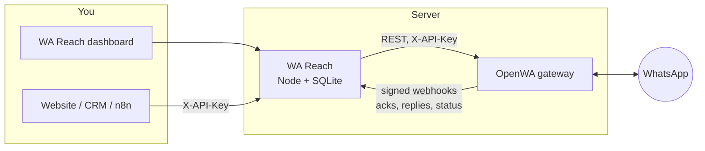

# WA Reach

WhatsApp marketing software built on the [OpenWA](https://github.com/rmyndharis/OpenWA) gateway.
OpenWA connects your WhatsApp numbers. WA Reach adds everything a marketing team needs on top of them:

- contacts with consent tracking
- segments
- campaigns with A/B tests
- drip sequences
- keyword auto-replies
- a shared inbox
- delivery, read, reply and click analytics


## Features

| Area | What you get |
| --- | --- |
| **Contacts** | CSV import from Excel, Sheets or a CRM (comma, semicolon and tab files). Column mapping is detected automatically. Phone numbers are normalized to E.164 with a default country. Also: tags, custom fields, bulk actions, export, and an optional check that each number is on WhatsApp. |
| **Consent** | Opt-in and opt-out are recorded with a source and timestamp. Replies of STOP, UNSUBSCRIBE and similar (configurable) unsubscribe the contact and send a confirmation. START and JOIN subscribe them. An import or API call can never re-subscribe someone who opted out. |
| **Segments** | Live audiences built from tags, custom fields (`city = Pune`, `last_order > 2500`), consent, WhatsApp status and activity dates. **Retargeting** on campaign engagement, e.g. "read the Diwali offer but didn't reply". |
| **Campaigns** | A four-step wizard: audience → message → sending → review. Other capabilities: <ul><li>Personalization with `{{first_name\|there}}`-style fallbacks</li><li>Image, video, audio and document attachments</li><li>WhatsApp formatting</li><li>A live phone preview</li><li>A/B/C variants with weighted splits</li><li>Scheduling</li><li>Test sends</li><li>Pause, resume, cancel and duplicate</li></ul> |
| **Analytics** | A per-campaign funnel (sent → delivered → read → replied → clicked) and unsubscribes attributed to the campaign that caused them. Also: A/B results with a leading version, hourly send timeline, per-recipient status and CSV export. The dashboard shows 14-day activity and a 30-day funnel. |
| **Link tracking** | URLs in a campaign become short per-recipient links (`/r/abc1234/…`), so you see who clicked. Link-preview bots are filtered out. |
| **Drip sequences** | Multi-step follow-ups with delays in minutes, hours or days. A sequence starts on a tag being added, on opt-in, or manually (also from an auto-reply). By default it stops when the contact replies or opts out. |
| **Auto-replies** | Rules that match messages exactly, by contains, by starts-with, by regex, or as a catch-all. They can reply (with media), add or remove tags, record consent and start a drip sequence. Each rule has a priority and a per-contact cooldown. |
| **Inbox** | Every conversation in one place. Each message shows its source label (campaign, drip, auto-reply) and read ticks, and you can reply with attachments. |
| **Safety** | Account-protection controls: <ul><li>Per-number caps per minute and per day</li><li>Per-campaign pacing with jitter</li><li>Quiet hours in your time zone</li><li>An optional frequency cap</li><li>Automatic campaign pause after repeated failures</li><li>Backoff when OpenWA's own warm-up pacing refuses a send</li></ul> |
| **Integrations** | A REST API with `X-API-Key`, e.g. to add leads from a website form, a CRM or n8n. |

## How it fits together



WA Reach never talks to WhatsApp directly. It sends through OpenWA's REST API. OpenWA reports delivery receipts, read receipts, inbound messages and session changes back through a webhook signed with HMAC-SHA256.

WA Reach registers that webhook on every OpenWA session automatically, including sessions created in OpenWA's own dashboard.

Keeping OpenWA as a separate, unmodified service means you can upgrade it independently. This version was built and tested against **OpenWA 0.23**.

## Quick start

### Try it without WhatsApp (demo mode)

Requires Node 22.13+.

```bash
cd wa-reach
npm install
npm run demo          # http://localhost:3000, password: demo-password
```

The demo runs a simulated OpenWA gateway with sample contacts, templates, automations, two weeks of campaign history and a campaign sending live. Receipts and customer replies arrive over real signed webhooks. Nothing is sent to WhatsApp.

### Run for real (Docker)

```bash
cd wa-reach
cp .env.example .env
# Set OPENWA_API_KEY (32+ random chars) and ADMIN_PASSWORD; optionally PUBLIC_URL and APP_API_KEY.
docker compose up -d --build
```

Then:

1. Open http://localhost:3000 and sign in.
2. Go to **WhatsApp numbers → Add number**, and scan the QR code from *WhatsApp → Settings → Linked devices*. You can also link with a pairing code.
3. Import contacts, then send a test campaign to yourself from the campaign's **Review** step.

The compose file runs the official OpenWA image with the settings WA Reach relies on:

| OpenWA setting | Why |
| --- | --- |
| `API_MASTER_KEY` | Shared with WA Reach as `OPENWA_API_KEY` |
| `SSRF_ALLOWED_HOSTS=wa-reach` | OpenWA refuses webhooks to private addresses otherwise |
| `SEND_PACING_ENABLED=true` | Adds OpenWA's warm-up ramp and cold-outreach caps |
| `RESOLVE_LID_TO_PHONE=true` | Maps privacy ids so replies reach the right contact |
| `ENGINE_TYPE=whatsapp-web.js` | The lower ban-risk engine |

OpenWA's own dashboard is published on `127.0.0.1:2785` only.

For click tracking, put WA Reach behind HTTPS (Caddy, nginx or Cloudflare Tunnel) and set `PUBLIC_URL`.

If Docker Hub rate-limits you, use `OPENWA_IMAGE=ghcr.io/rmyndharis/openwa:0.23` and `docker compose build --build-arg NODE_IMAGE=mirror.gcr.io/library/node:22-alpine`.

### Run without Docker

Start OpenWA however you like, then:

```bash
cd wa-reach
npm install && npm run build
OPENWA_URL=http://localhost:2785 OPENWA_API_KEY=... ADMIN_PASSWORD=... npm start
```

`WEBHOOK_URL` must be an address OpenWA can reach. It defaults to `$PUBLIC_URL/webhooks/openwa`, or to `http://localhost:3000/webhooks/openwa` when `PUBLIC_URL` is unset. If that host is private, add it to OpenWA's `SSRF_ALLOWED_HOSTS`.

## Configuration

| Variable | Default | Purpose |
| --- | --- | --- |
| `OPENWA_URL` | `http://localhost:2785` | OpenWA base URL |
| `OPENWA_API_KEY` | – | OpenWA API key (operator or admin) |
| `ADMIN_PASSWORD` | generated | Dashboard password. If unset, one is generated into `DATA_DIR/admin-password` and logged on first boot. |
| `PUBLIC_URL` | – | Public URL of WA Reach. Enables click tracking and secure cookies (for `https`). |
| `WEBHOOK_URL` | `$PUBLIC_URL/webhooks/openwa` | Where OpenWA posts events |
| `APP_API_KEY` | – | Enables REST access with `X-API-Key` (min 16 chars) |
| `OPENWA_WEBHOOK_SECRET` | generated | HMAC secret registered on OpenWA webhooks |
| `APP_SECRET` | generated | Cookie signing key |
| `DATA_DIR` | `./data` | SQLite database, media library and generated secrets |
| `DEFAULT_TIMEZONE` / `DEFAULT_COUNTRY` | `Asia/Kolkata` / `IN` | Defaults for a new install. Both can be changed in Settings. |
| `TRUST_PROXY` | private networks | Which reverse proxies may set `X-Forwarded-*` |
| `PORT` / `HOST` | `3000` / `0.0.0.0` | Listen address |

Business settings are edited in the dashboard under **Settings**:

- time zone and default country
- quiet hours
- per-number limits
- frequency cap
- failure threshold
- opt-in and opt-out keywords, confirmation replies and the unsubscribe line
- reply attribution window

## Sending safety

WA Reach connects through OpenWA's unofficial WhatsApp Web clients, not Meta's Cloud API. WhatsApp can restrict a number that looks like spam, so the defaults are conservative.

- **One message at a time per number.** Each number is capped per minute (default 10) and per day (default 250 marketing messages; replies don't count). Sends are jittered. Several campaigns on one number take turns.
- **Priorities.** Replies to people who just wrote to you go first, then due drip steps, then campaigns.
- **Quiet hours.** Default 21:00–09:00. Campaigns wait and continue afterwards.
- **Consent at send time.** Opt-outs, missing opt-in (when required), invalid numbers and the frequency cap are re-checked right before each message.
- **Self-pausing.** After 5 rejected sends in a row a campaign pauses with the reason shown. When OpenWA's pacing refuses a send (HTTP 429), the number backs off for the time OpenWA asks and nothing is marked failed.
- **No double sends.** A message is marked *sending* before the API call. After a crash, anything left mid-send is marked *unknown* and never retried.

Practical guidance:

- Use a dedicated number.
- Warm it up for a few days before bulk sending.
- Message people who opted in.
- For regulated or high-volume use, prefer Meta's official WhatsApp Cloud API.

## REST API

Every dashboard action is a JSON endpoint under `/api`. With `APP_API_KEY` set, send `X-API-Key: <key>` from your server. Don't put the key in browser code.

```bash
# Add or update a lead (tags are created on the fly; consent is recorded with its source)
curl -X POST https://reach.example.com/api/contacts \
  -H "X-API-Key: $APP_API_KEY" -H "Content-Type: application/json" \
  -d '{"phone":"+919876543210","name":"Priya","tags":["website-lead"],"consent":"opted_in","consentSource":"website form"}'
```

Useful endpoints:

| Endpoint | Purpose |
| --- | --- |
| `GET /api/contacts?q=&tagId=&consent=&segmentId=` | Search contacts |
| `POST /api/contacts/bulk` | Bulk actions: tag, consent, delete, verify on WhatsApp |
| `POST /api/campaigns` then `POST /api/campaigns/:id/launch` | Create and send (or schedule) a campaign |
| `GET /api/campaigns/:id/report` | Campaign results |
| `GET /api/campaigns/:id/recipients.csv` | Per-recipient export |
| `POST /api/sequences/:id/enroll` | Start a drip sequence for contacts |
| `GET /api/inbox`, `POST /api/inbox/:contactId/send` | Read and reply to conversations |

## Screenshots

| Campaign report with A/B results | Shared inbox |
| --- | --- |
|  |  |
| **Campaign editor with live preview** | **Auto-replies** |
|  |  |

Dark mode follows the operating system:


## Development

```bash
npm run dev        # API on :3000 with reload + Vite on :5173 (proxying /api)
npm test           # 61 unit + integration tests against an in-process fake OpenWA
npm run typecheck  # server, web, tests and scripts
npm run build      # dist/server + dist/web
```

The integration tests drive the real HTTP stack against `test/fake-openwa.ts`, which speaks OpenWA's HTTP contract: `X-API-Key` auth, session and webhook routes, error bodies, and 429 pacing refusals. They cover:

- CSV import, personalization and link tracking
- pacing and quiet hours
- the daily cap and the failure breaker
- crash recovery
- STOP and START handling
- reply and opt-out attribution
- auto-reply cooldowns
- drip timing
- webhook signature checks and deduplication
- auth and CSRF

```
server/
  services/     dispatcher (sending engine), campaigns, contacts, segments, sequences,
                auto-replies, inbound (webhooks), sessions (OpenWA numbers), analytics
  openwa/       typed OpenWA REST client
  lib/          phone normalization, templating, CSV, time zones, links, crypto
  db/           SQLite schema (node:sqlite, no native dependencies)
web/src/        React dashboard (Vite)
test/           vitest suites + fake OpenWA gateway
scripts/demo.ts demo mode
```

## License

WA Reach runs OpenWA as a separate service and contains none of its code. OpenWA is MIT-licensed.
`package.json` declares MIT for WA Reach; change it there if you prefer another license.
