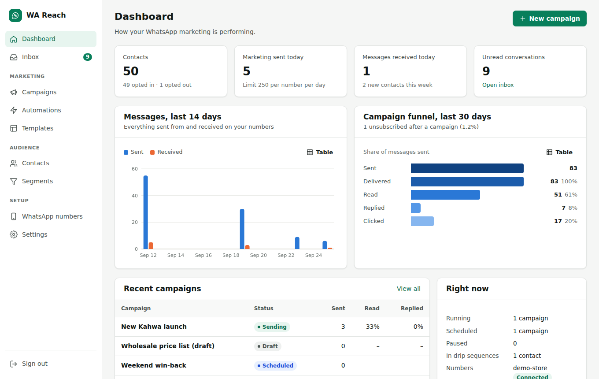
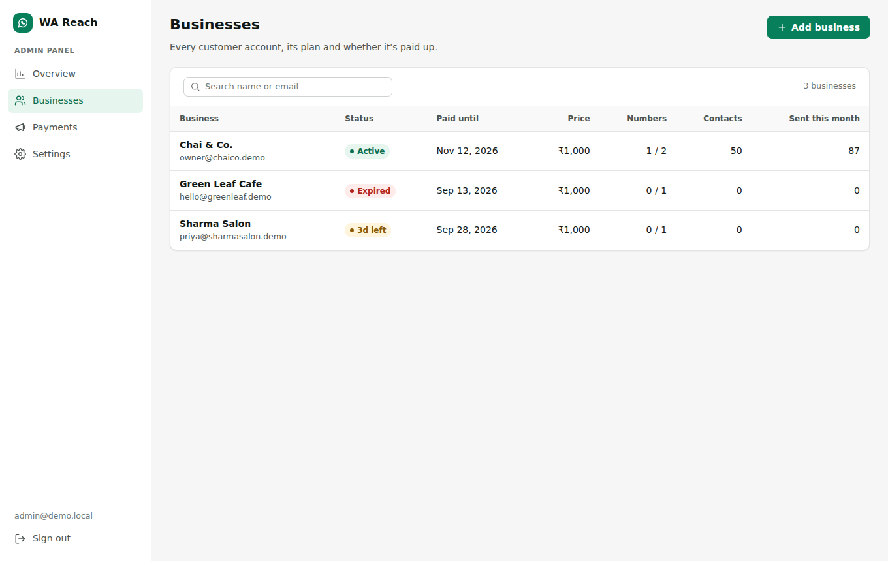
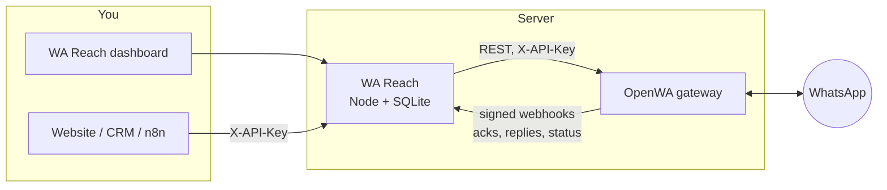
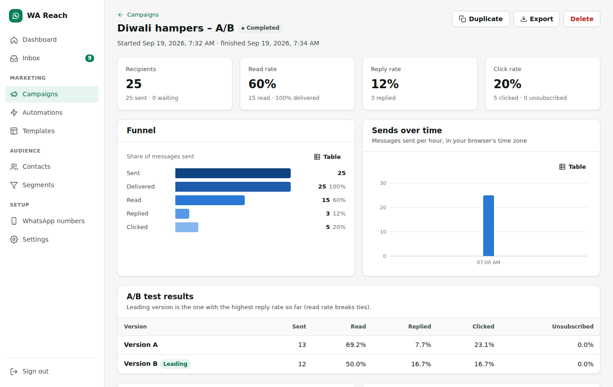
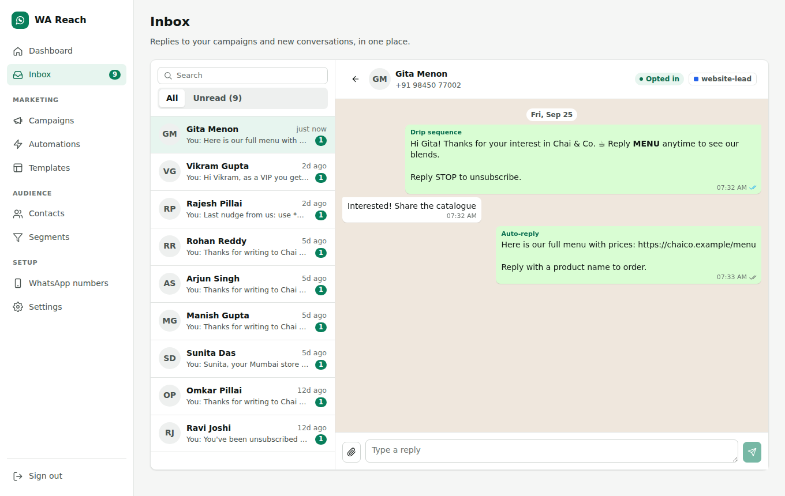
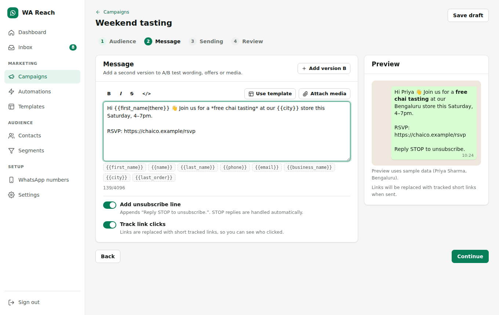
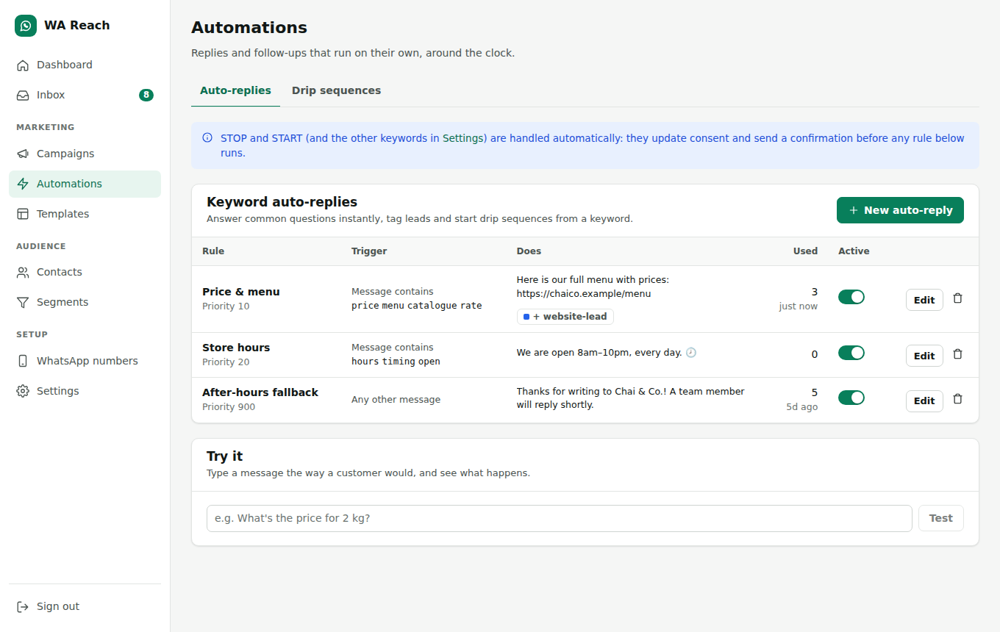
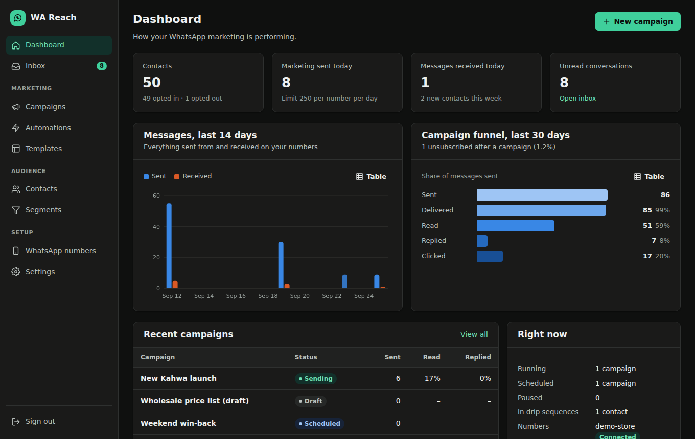

# WA Reach

WhatsApp marketing software built on the [OpenWA](https://github.com/rmyndharis/OpenWA) gateway.
OpenWA connects your WhatsApp numbers. WA Reach adds everything a marketing team needs on top of them. It runs as a **multi-business SaaS**: you host one install and sell monthly access to business owners from an admin panel.

Each business gets:

- contacts with consent tracking
- segments
- campaigns with A/B tests
- drip sequences
- keyword auto-replies
- a shared inbox
- delivery, read, reply and click analytics



## Selling it as a service

One install serves many businesses. As the platform owner you sign in to the **admin panel**. Each business owner signs in to their own workspace and sees only their own numbers, contacts, campaigns and inbox.



| Admin panel | What it does |
| --- | --- |
| **Overview** | Monthly recurring revenue, money collected this month, businesses expiring in the next 7 days, and businesses that need attention (expired, suspended, or with a disconnected number). |
| **Businesses** | Add a business: name, contact, monthly price (default ₹1,000), number of WhatsApp numbers allowed and trial days. You get the owner's login and a temporary password to send them. From a business's page you can edit the plan, record a payment, suspend or reactivate, reset a password, add logins, open their workspace to help them, or delete the business. |
| **Payments** | Record a payment received by UPI, cash, bank transfer or card. Each payment extends "paid until" by the months paid, starting from the current end date so early renewals are never lost. All payments are listed with the period they cover. |
| **Settings** | Your brand name (shown on the login page and sidebar), the support contact shown to businesses when they need to renew, currency symbol, default price, default number limit, trial length and grace period. |

How a subscription behaves:

| State | When | What the business can do |
| --- | --- | --- |
| **Active** | Paid until a future date. A reminder banner shows in the last 5 days. | Everything |
| **Grace** | Up to 3 days (configurable) after the paid-until date | Everything, with a "renew now" banner |
| **Expired** | After the grace period | Sign in and view data. Sending stops and changes are blocked until you record a payment. |
| **Suspended** | You suspended it | Same as expired, whatever the paid-until date |

Recording a payment or reactivating a business resumes its campaigns and automations within a minute.

Business owners can manage their own team logins, change their password, create an API key and see their payment history under **Account & billing**.

Numbers are isolated per business. All businesses share one OpenWA gateway, and each business's numbers are stored in OpenWA with the business id as a prefix. A business can only list, use or receive webhooks for its own numbers, up to its plan limit.

## Features

| Area | What you get |
| --- | --- |
| **Contacts** | CSV import from Excel, Sheets or a CRM (comma, semicolon and tab files). Column mapping is detected automatically. Phone numbers are normalized to E.164 with a default country. Also: tags, custom fields, bulk actions, export, and an optional check that each number is on WhatsApp. |
| **Consent** | Opt-in and opt-out are recorded with a source and timestamp. Replies of STOP, UNSUBSCRIBE and similar (configurable) unsubscribe the contact and send a confirmation. START and JOIN subscribe them. An import or API call can never re-subscribe someone who opted out. |
| **Segments** | Live audiences built from tags, custom fields (`city = Pune`, `last_order > 2500`), consent, WhatsApp status and activity dates. **Retargeting** on campaign engagement, e.g. "read the Diwali offer but didn't reply". |
| **Campaigns** | A four-step wizard: audience → message → sending → review. Other capabilities: <ul><li>Personalization with `{{first_name\|there}}`-style fallbacks</li><li>Image, video, audio and document attachments</li><li>WhatsApp formatting</li><li>A live phone preview</li><li>A/B/C variants with weighted splits</li><li>Scheduling</li><li>Test sends</li><li>Pause, resume, cancel and duplicate</li></ul> |
| **Analytics** | A per-campaign funnel (sent → delivered → read → replied → clicked) and unsubscribes attributed to the campaign that caused them. Also: A/B results with a leading version, hourly send timeline, per-recipient status and CSV export. The dashboard shows 14-day activity and a 30-day funnel. |
| **Link tracking** | URLs in a campaign become short per-recipient links (`/r/abc1234/…`), so you see who clicked. Link-preview bots are filtered out. |
| **Drip sequences** | Multi-step follow-ups with delays in minutes, hours or days. A sequence starts on a tag being added, on opt-in, or manually (also from an auto-reply). By default it stops when the contact replies or opts out. |
| **Auto-replies** | Rules that match messages exactly, by contains, by starts-with, by regex, or as a catch-all. They can reply (with media), add or remove tags, record consent and start a drip sequence. Each rule has a priority and a per-contact cooldown. |
| **Inbox** | Every conversation in one place. Each message shows its source label (campaign, drip, auto-reply) and read ticks, and you can reply with attachments. |
| **Safety** | Account-protection controls: <ul><li>Per-number caps per minute and per day</li><li>Per-campaign pacing with jitter</li><li>Quiet hours in your time zone</li><li>An optional frequency cap</li><li>Automatic campaign pause after repeated failures</li><li>Backoff when OpenWA's own warm-up pacing refuses a send</li></ul> |
| **Official WhatsApp API** | Besides QR-linked numbers, a business can connect its own number through **Meta's official WhatsApp Cloud API** (WhatsApp numbers → Add number → Official WhatsApp Business API). The connect form sits next to a step-by-step guide (and an optional YouTube video the platform admin sets in Admin → Settings). Campaigns on official numbers send Meta-approved templates with personalized variables; replies, auto-replies and drips work inside WhatsApp's 24-hour window. Replies, delivered/read ticks and failures arrive through a signed webhook (`/webhooks/meta/<business>`). Access tokens and app secrets are stored encrypted and never shown again. Needs `PUBLIC_URL` so Meta can reach the webhook. |
| **Integrations** | A REST API with `X-API-Key`, e.g. to add leads from a website form, a CRM or n8n. |

## How it fits together



WA Reach never talks to WhatsApp directly. It sends through OpenWA's REST API. OpenWA reports delivery receipts, read receipts, inbound messages and session changes back through a webhook signed with HMAC-SHA256.

WA Reach registers that webhook on every OpenWA session automatically, including sessions created in OpenWA's own dashboard.

Keeping OpenWA as a separate, unmodified service means you can upgrade it independently. This version was built and tested against **OpenWA 0.23**.

## Quick start

### Try it without WhatsApp (demo mode)

Requires Node 22.13+.

```bash
cd wa-reach
npm install
npm run demo          # http://localhost:3000
```

Sign in with any of these (password `demo-password` for all):

| Login | What you see |
| --- | --- |
| `admin@demo.local` | The admin panel with three businesses and their payments |
| `owner@chaico.demo` | A business workspace full of sample data |
| `priya@sharmasalon.demo` | A business whose subscription ends in 3 days |
| `hello@greenleaf.demo` | A business whose subscription expired (sending blocked) |

The demo runs a simulated OpenWA gateway with sample contacts, templates, automations, two weeks of campaign history and a campaign sending live. Receipts and customer replies arrive over real signed webhooks. Nothing is sent to WhatsApp.

### Try it with real WhatsApp in your browser (GitHub Codespaces)

No install needed. On GitHub, open the repository, choose this branch, then **Code → Codespaces → Create codespace**. The setup starts WA Reach and OpenWA, opens the dashboard, and prints an admin login in the terminal (also saved in `wa-reach/.env`). Scan the QR code from **WhatsApp numbers** as usual.

A codespace stops after 30 minutes idle and the WhatsApp link pauses with it. It's meant for testing; use a server to run it for customers.

### Run for real (Docker)

```bash
cd wa-reach
cp .env.example .env
# Set ADMIN_EMAIL, ADMIN_PASSWORD and OPENWA_API_KEY (32+ random chars).
docker compose up -d --build
```

Then:

1. Open http://localhost:3000 and sign in with `ADMIN_EMAIL` / `ADMIN_PASSWORD`. You land in the admin panel.
2. **Businesses → Add business**. Note the owner's email and temporary password.
3. Sign out and sign in as that owner, or click **Open workspace** in the admin panel.
4. Go to **WhatsApp numbers → Add number**, and scan the QR code from *WhatsApp → Settings → Linked devices*. You can also link with a pairing code.
5. Import contacts, then send a test campaign to yourself from the campaign's **Review** step.

The compose file runs the official OpenWA image with the settings WA Reach relies on:

| OpenWA setting | Why |
| --- | --- |
| `API_MASTER_KEY` | Shared with WA Reach as `OPENWA_API_KEY` |
| `SSRF_ALLOWED_HOSTS=wa-reach` | OpenWA refuses webhooks to private addresses otherwise |
| `SEND_PACING_ENABLED=true` | Adds OpenWA's warm-up ramp and cold-outreach caps |
| `RESOLVE_LID_TO_PHONE=true` | Maps privacy ids so replies reach the right contact |
| `ENGINE_TYPE=whatsapp-web.js` | The lower ban-risk engine |

OpenWA's own dashboard is published on `127.0.0.1:2785` only.

For click tracking and secure cookies, run it behind HTTPS and set `PUBLIC_URL` (see below).

If Docker Hub rate-limits you, use `OPENWA_IMAGE=ghcr.io/rmyndharis/openwa:0.23` and `docker compose build --build-arg NODE_IMAGE=mirror.gcr.io/library/node:22-alpine`.

### Go live on your own server

You need a Linux VPS (Ubuntu 22.04+ works well) and a domain or subdomain, e.g. `app.yourbrand.com`.

1. **Size the server.** On the `whatsapp-web.js` engine each connected number runs a headless browser that uses about 300–500 MB of RAM. Plan for 2 GB of RAM for up to about 3 numbers, 4 GB for about 8, and 8 GB for about 15–20. Set `OPENWA_MEM_LIMIT` to match.
2. **Point DNS.** Create an `A` record for `app.yourbrand.com` pointing to the server's IP address.
3. **Install Docker.** `curl -fsSL https://get.docker.com | sh`
4. **Get the code and configure it.**

   ```bash
   git clone <this repository> && cd <repository>/wa-reach
   cp .env.example .env
   nano .env
   ```

   Set these values:

   ```ini
   ADMIN_EMAIL=you@yourbrand.com
   ADMIN_PASSWORD=<a strong password>
   OPENWA_API_KEY=<output of: openssl rand -base64 36>
   DOMAIN=app.yourbrand.com
   PUBLIC_URL=https://app.yourbrand.com
   ```

5. **Open the firewall** for ports 80 and 443 (e.g. `ufw allow 80,443/tcp`), plus SSH.
6. **Start it.**

   ```bash
   docker compose -f docker-compose.yml -f docker-compose.prod.yml up -d --build
   ```

   Caddy gets an HTTPS certificate automatically. Open `https://app.yourbrand.com` and sign in.

7. **Back up** the `wa-reach-data` and `openwa-data` Docker volumes daily. The first holds every business's data. The second holds the WhatsApp logins, so without it every number has to scan its QR code again.

To update later: `git pull`, then run the same `docker compose … up -d --build` command.

### Run without Docker

Start OpenWA however you like, then:

```bash
cd wa-reach
npm install && npm run build
OPENWA_URL=http://localhost:2785 OPENWA_API_KEY=... ADMIN_EMAIL=... ADMIN_PASSWORD=... npm start
```

`WEBHOOK_URL` must be an address OpenWA can reach. It defaults to `$PUBLIC_URL/webhooks/openwa`, or to `http://localhost:3000/webhooks/openwa` when `PUBLIC_URL` is unset. Each business's webhook is that URL plus `/<business id>`. If that host is private, add it to OpenWA's `SSRF_ALLOWED_HOSTS`.

## Configuration

| Variable | Default | Purpose |
| --- | --- | --- |
| `OPENWA_URL` | `http://localhost:2785` | OpenWA base URL |
| `OPENWA_API_KEY` | – | OpenWA API key (operator or admin) |
| `ADMIN_EMAIL` | `admin@example.com` | Platform admin login, created on first boot |
| `ADMIN_PASSWORD` | generated | Platform admin password on first boot. If unset, one is generated into `DATA_DIR/admin-password` and logged. Change it later in the admin panel's Settings. |
| `PUBLIC_URL` | – | Public URL of WA Reach. Enables click tracking and secure cookies (for `https`). |
| `WEBHOOK_URL` | `$PUBLIC_URL/webhooks/openwa` | Where OpenWA posts events |
| `OPENWA_WEBHOOK_SECRET` | generated | HMAC secret registered on OpenWA webhooks |
| `APP_SECRET` | generated | Cookie signing key |
| `DATA_DIR` | `./data` | Platform database, one SQLite database and media folder per business under `tenants/`, and generated secrets |
| `DOMAIN` | – | Your domain, for the HTTPS add-on (`docker-compose.prod.yml`) |
| `WA_REACH_BIND` | `127.0.0.1` | Address port 3000 is published on. The default keeps it private, so people reach the app only through HTTPS (Caddy). |
| `DEFAULT_TIMEZONE` / `DEFAULT_COUNTRY` | `Asia/Kolkata` / `IN` | Defaults for a new install. Both can be changed in Settings. |
| `TRUST_PROXY` | private networks | Which reverse proxies may set `X-Forwarded-*` |
| `PORT` / `HOST` | `3000` / `0.0.0.0` | Listen address |

Each business edits its own settings in its workspace under **Settings**:

- time zone and default country
- quiet hours
- per-number limits
- frequency cap
- failure threshold
- opt-in and opt-out keywords, confirmation replies and the unsubscribe line
- reply attribution window

## Sending safety

WA Reach connects through OpenWA's unofficial WhatsApp Web clients, not Meta's Cloud API. WhatsApp can restrict a number that looks like spam, so the defaults are conservative.

- **One message at a time per number.** Each number is capped per minute (default 10) and per day (default 250 marketing messages; replies don't count). Sends are jittered. Several campaigns on one number take turns.
- **Priorities.** Replies to people who just wrote to you go first, then due drip steps, then campaigns.
- **Quiet hours.** Default 21:00–09:00. Campaigns wait and continue afterwards.
- **Consent at send time.** Opt-outs, missing opt-in (when required), invalid numbers and the frequency cap are re-checked right before each message.
- **Self-pausing.** After 5 rejected sends in a row a campaign pauses with the reason shown. When OpenWA's pacing refuses a send (HTTP 429), the number backs off for the time OpenWA asks and nothing is marked failed.
- **No double sends.** A message is marked *sending* before the API call. After a crash, anything left mid-send is marked *unknown* and never retried.

Practical guidance:

- Use a dedicated number.
- Warm it up for a few days before bulk sending.
- Message people who opted in.
- For regulated or high-volume use, prefer Meta's official WhatsApp Cloud API.

## REST API

Every dashboard action is a JSON endpoint under `/api`. A business owner creates an API key under **Account & billing**; requests with `X-API-Key: <key>` act on that business only. Send it from a server, never from browser code.

```bash
# Add or update a lead (tags are created on the fly; consent is recorded with its source)
curl -X POST https://reach.example.com/api/contacts \
  -H "X-API-Key: $WA_REACH_API_KEY" -H "Content-Type: application/json" \
  -d '{"phone":"+919876543210","name":"Priya","tags":["website-lead"],"consent":"opted_in","consentSource":"website form"}'
```

Useful endpoints:

| Endpoint | Purpose |
| --- | --- |
| `GET /api/contacts?q=&tagId=&consent=&segmentId=` | Search contacts |
| `POST /api/contacts/bulk` | Bulk actions: tag, consent, delete, verify on WhatsApp |
| `POST /api/campaigns` then `POST /api/campaigns/:id/launch` | Create and send (or schedule) a campaign |
| `GET /api/campaigns/:id/report` | Campaign results |
| `GET /api/campaigns/:id/recipients.csv` | Per-recipient export |
| `POST /api/sequences/:id/enroll` | Start a drip sequence for contacts |
| `GET /api/inbox`, `POST /api/inbox/:contactId/send` | Read and reply to conversations |

## Screenshots

| Campaign report with A/B results | Shared inbox |
| --- | --- |
|  |  |
| **Campaign editor with live preview** | **Auto-replies** |
|  |  |

Dark mode follows the operating system:



## Development

```bash
npm run dev        # API on :3000 with reload + Vite on :5173 (proxying /api)
npm test           # 67 unit + integration tests against an in-process fake OpenWA
npm run typecheck  # server, web, tests and scripts
npm run build      # dist/server + dist/web
```

The integration tests drive the real HTTP stack against `test/fake-openwa.ts`, which speaks OpenWA's HTTP contract: `X-API-Key` auth, session and webhook routes, error bodies, and 429 pacing refusals. They cover:

- CSV import, personalization and link tracking
- pacing and quiet hours
- the daily cap and the failure breaker
- crash recovery
- STOP and START handling
- reply and opt-out attribution
- auto-reply cooldowns
- drip timing
- webhook signature checks and deduplication
- auth and CSRF
- multi-business isolation, subscriptions (grace, expiry, suspension), payments and admin impersonation

```
server/
  services/     dispatcher (sending engine), campaigns, contacts, segments, sequences,
                auto-replies, inbound (webhooks), sessions (OpenWA numbers), analytics
  openwa/       typed OpenWA REST client
  lib/          phone normalization, templating, CSV, time zones, links, crypto
  db/           SQLite schema (node:sqlite, no native dependencies)
  platform/     businesses, logins, subscriptions and payments; one runtime per business
  routes/       REST API, admin panel and account endpoints
web/src/        React dashboard (Vite)
test/           vitest suites + fake OpenWA gateway
scripts/demo.ts demo mode
```

## License

WA Reach runs OpenWA as a separate service and contains none of its code. OpenWA is MIT-licensed.
`package.json` declares MIT for WA Reach; change it there if you prefer another license.
